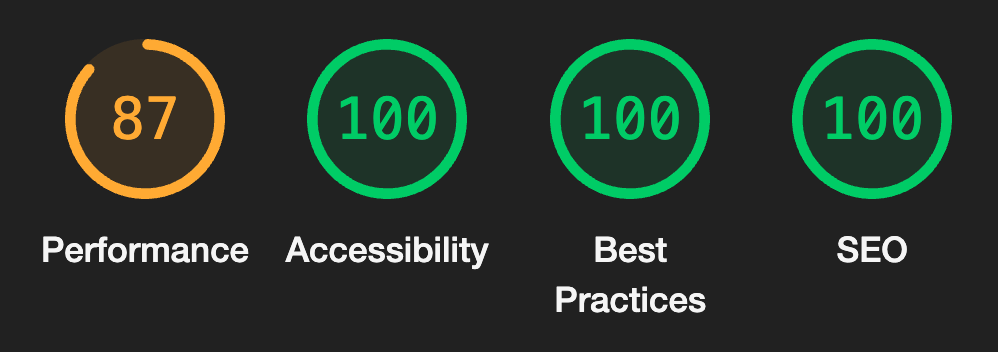

# Onsite Support QR Landing Page

[](https://qrlanding.netlify.app/)

[Demo](https://qrlanding.netlify.app/) | [Documentation](https://support.onsitesupport.io/) | [Website](https://onsitesupport.io/)

## Overview

A front-end landing page prototype created as an option for [Onsite Support](https://onsitesupport.io/) customers. This has a "mobile-only" approach that focuses on a specific product to—highlight features, information, or registration options. This package would not require the need to develop a responsive soulution for larger screens since the content has been streamlined to a few items, actions grouped, and the minimal UI allows you clearly view the hero media.

### Performance Audits



We are taking performance hits by using YouTube as our video source. Embedding video without third-party bloat is ideal. Either way, we should create a [`facade`](https://developer.chrome.com/docs/lighthouse/performance/third-party-facades/) to help limit the amount of code needed for first paint. We see some gains when we add `loading=lazy` & remove `autoplay`.

#### REPORTS

[Autoplay Enabled](https://qrlanding.netlify.app/](https://qrlanding.netlify.app/perf/autoplay)) • [Autoplay Disabled](https://support.onsitesupport.io/](https://qrlanding.netlify.app/perf/no-autoplay)) • [Production](https://support.onsitesupport.io/](https://qrlanding.netlify.app/perf/current))


#### Setup
In your terminal, `run` the following to start this app locally.

```sh
git clone https://github.com/ericthayer/qr-landing.git
cd qr-landing/
npm install
npm start
```
server: `http://localhost:3000`

#### scripts 

`package.json`

```json
"build": "npm run css",
"css-compile": "sass --style compressed --source-map --embed-sources --no-error-css --load-path=node_modules scss/:css/",
"css-lint": "stylelint scss/",
"css-prefix": "postcss --replace css/styles.css --use autoprefixer --map",
"css": "npm-run-all css-compile css-prefix",
"server": "sirv --dev --no-clear --port 3000",
"start": "npm-run-all --parallel watch server",
"watch": "nodemon -e html,scss -x \"npm run css\"",
"test": "npm-run-all css-lint css"
```

#### markup

`index.html`

#### styles

`scss/styles.scss`

#### things to improve

- performance issues with video
- local build DOES NOT live-reload browser
- OS platorm editor only accepts pasted code on intial submission
- serve .webp format
- host base stylesheet
