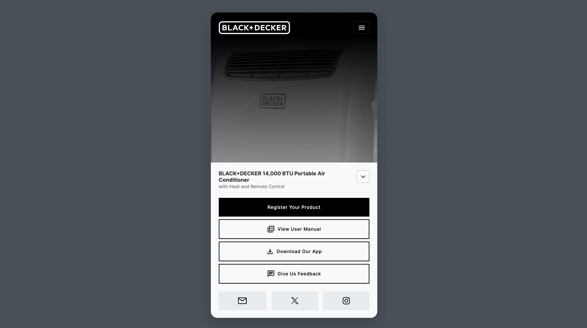

# Onsite Support QR Landing Template

Front-end landing page concept created with [`Bootstrap 5.3`](https://getbootstrap.com/docs/5.3/getting-started/introduction/) for Onsite Support demo purposes.

[](https://qrlanding.netlify.app/)

[Live Demo](https://qrlanding.netlify.app/)

## markup 

`index.html`

## css 

`scss/styles.scss`


## How to use

```sh
git clone https://github.com/ericthayer/qr-landing.git
cd qr-landing/
npm install
npm start
```
